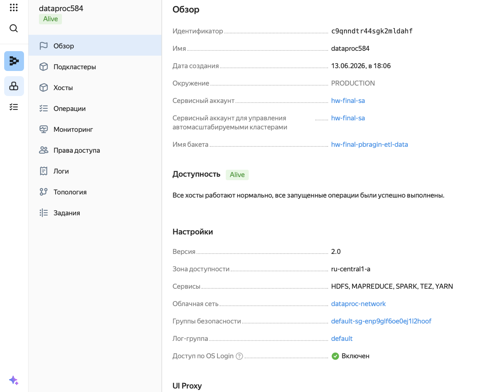
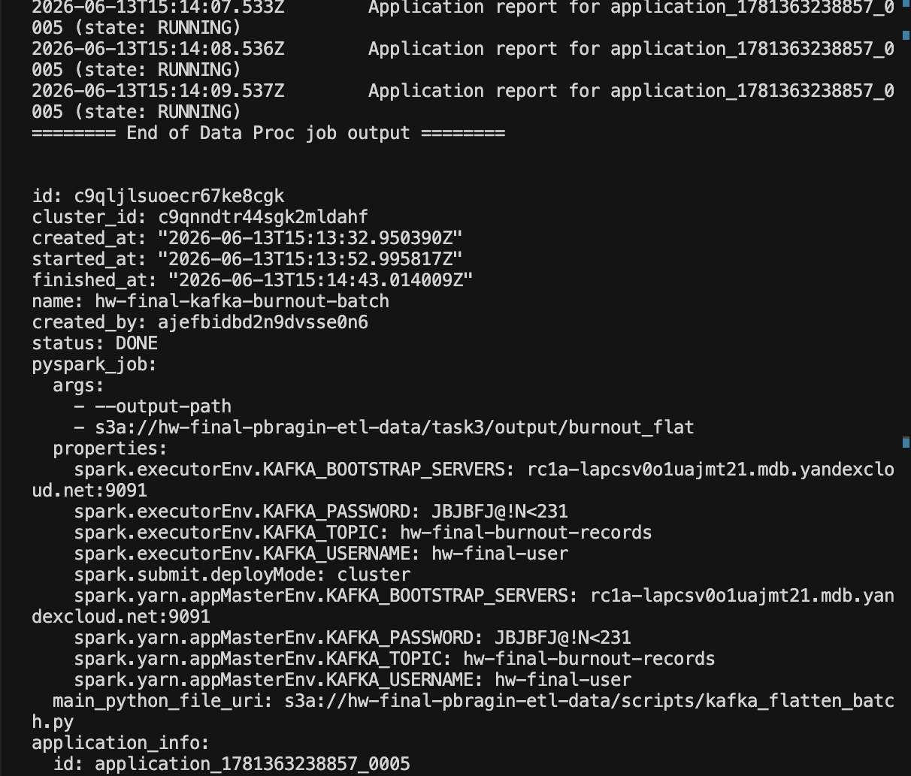
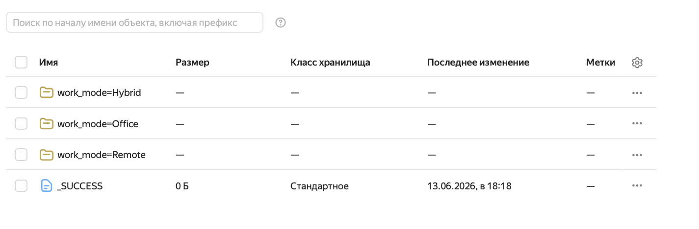

## Задание 1. Перенос данных из YDB в Object Storage (Yandex DataTransfer)

1. **Создана база данных** `ydb238` в Managed Service for Yandex Database.
2. **Сгенерированы тестовые данные** `transactions_v2` объёмом **30 МБ**.
3. **Данные загружены в YDB** через веб‑консоль и YDB CLI.
4. **Созданы эндпоинты:** источник — YDB, приёмник — Object Storage (бакет `basket`).
5. **Настроен и активирован трансфер** типа `Snapshot`.
6. **Трансфер успешно выполнен** — данные перенесены в CSV.

**Результат:** В бакете `basket` в папке `from_YDB` появился CSV-файл с данными `transactions_v2`.

> Данные загружены через Data Transfer — самый простой способ, соответствующий условию задания (способ добавления данных в YDB не регламентирован).

---

## Задание 2. Автоматизация обработки с Airflow и Yandex Data Processing

1. **Инфраструктура:**
   - Сервисный аккаунт `my-editor` (роли `dataproc.agent`, `storage.editor`, `editor`).
   - Бакет `basket`.
   - Кластер Airflow `airflow811` (2.10).
   - Кластер Data Proc `dataproc420` (2.1, `YARN`, `SPARK`, `c3-c2-m4`).

2. **Данные:**
   - CSV `applications.csv` объёмом **52 МБ** загружен в `basket/input/`.

3. **PySpark-задание (`process_applications.py`):**
   - Чтение из `s3a://basket/input/applications.csv`.
   - Очистка, агрегация по `decision_status`, `risk_level`.
   - Сохранение в Parquet в `basket/output/`.

4. **DAG `exam_etl_dag`:**
   - `create_cluster` → `run_processing` → `delete_cluster`.

5. **Результат:** DAG выполнен, в `basket/output/` — Parquet, `_SUCCESS`, `summary.csv`.

**Вывод:** Полностью автоматизированный ETL-пайплайн без ошибок.

**Файлы:**
![[exam_etl_dag.py]]
![[Финальное задание/2/process_burnout.py]]

---

## Задание 3. Потоковая обработка Kafka + PySpark

1. **Архитектура:**
   - Кластер Kafka (3.x, публичный доступ, `ru-central1-e`).
   - Топик `loan-applications` (1 партиция).
   - Пользователь `producer` (права `PRODUCER` + `CONSUMER`).

2. **Продюсер (`kafka_produce_burnout.py`):**
   - Генерация JSON по структуре задания.
   - Отправка в Kafka через SASL/SSL.
   - Накоплено **>20 МБ** (>10 000 сообщений).

3. **PySpark-ридер (`kafka_flatten_stream.py`):**
   - `readStream` из Kafka.
   - Схема JSON (`StructType`).
   - Разложение вложенных полей в плоский вид.
   - Вывод в консоль и сохранение в Parquet.

4. **Запуск:** кластер Data Proc, задание выполнено, данные сохранены в `basket/task3/output/`.

**Вывод:** Потоковый ETL (Kafka → Spark Streaming → JSON‑парсинг → S3) отработал, объём >20 МБ.

**Файлы:**
![[Финальное задание/3/scripts/kafka_flatten_batch.py]]
![[Финальное задание/3/scripts/kafka_flatten_stream.py]]
![[Финальное задание/3/scripts/kafka_produce_burnout.py]]

---

## Общий вывод

| Задание | Реализовано                          |
| ------- | ------------------------------------ |
| 1       | YDB → Object Storage (Data Transfer) |
| 2       | Airflow + PySpark ETL                |
| 3       | Kafka → Spark Streaming (20+ МБ)     |